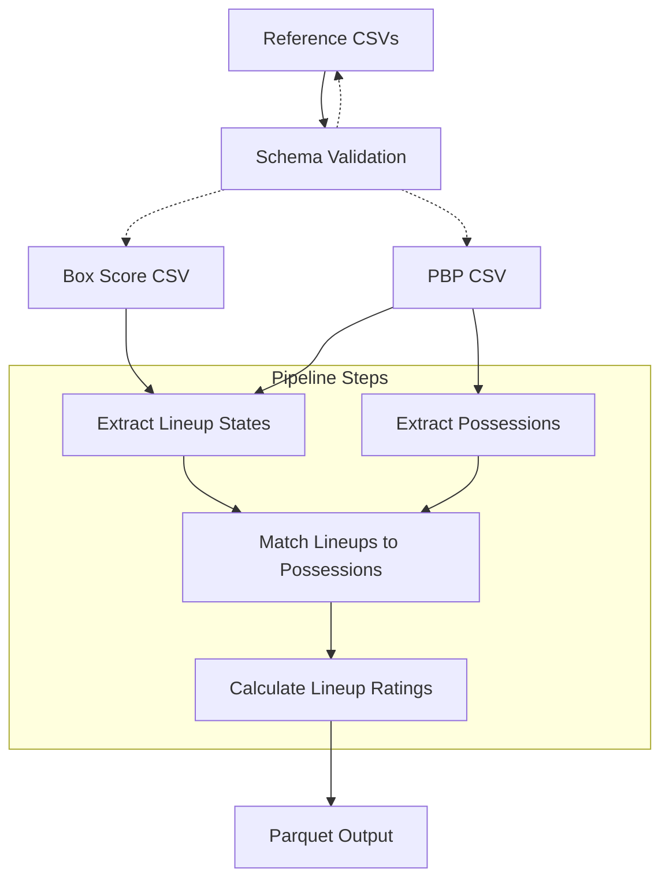
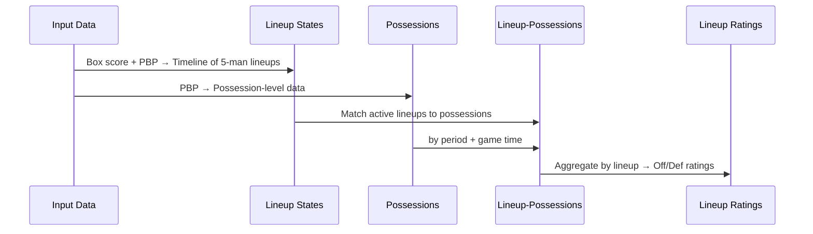

# Lineup Ratings Pipeline

ETL pipeline for calculating 5-man lineup performance metrics from NBA play-by-play and box score data.

## Architecture



## Data Flow



## Core Transformations

### 1. Lineup States (`lineup_states.py`)
**Input**: Box score (starters) + PBP (substitutions)  
**Output**: Timeline of 5-man lineups by team/period/time

**Logic**:
- Extract starting 5 from `startPos` field in box score
- Parse substitutions from PBP `msgType = 8` events
- Build chronological timeline of lineup changes
- Generate unique `lineup_id` for each 5-man combination

### 2. Possessions (`possessions.py`)
**Input**: PBP events  
**Output**: Possession-level records with start/end times and points scored

**Logic**:
- Possession ends on: made shots, defensive rebounds, turnovers, last free throw, period end
- Handle edge cases: and-1 situations, free throw sequences
- Calculate possession duration and points scored per possession

### 3. Lineup-Possessions (`lineup_possessions.py`)
**Input**: Lineup states + Possessions  
**Output**: Each possession matched to offensive/defensive lineups

**Logic**:
- Time-based join: find active lineups at possession start time
- Match by `period` and `game_clock_seconds`
- Output includes both offensive and defensive lineup for each possession

### 4. Lineup Ratings (`lineup_ratings.py`)
**Input**: Lineup-possessions data  
**Output**: Performance metrics per unique 5-man lineup

## Calculations

### Rating Formulas
```
off_rating = (points_scored / offensive_possessions) × 100
def_rating = (points_allowed / defensive_possessions) × 100  
net_rating = off_rating - def_rating
```

### Aggregation Logic
- Group by unique 5-man lineup (sorted player IDs)
- Sum possessions and points for offensive/defensive situations
- Calculate per-100-possession rates
- Handle lineups with only offensive or defensive data

## Data Assumptions

### Schema Requirements
- **Box Score**: `startPos` identifies starters, `nbaId` for player IDs, `nbaTeamId` for team mapping
- **PBP**: `msgType` classifies events, `gameClock` in MM:SS format, `playerId1/2` for substitutions

### Basketball Logic Assumptions
- **Possession Endings**: 
  - Made shots (`msgType = 1`) end possessions unless and-1 situation
  - Defensive rebounds (`msgType = 4`) when rebounding team ≠ shooting team
  - Turnovers (`msgType = 5`) always end possessions
  - Free throws (`msgType = 3`) only when last in sequence
  - Period ends (`msgType = 12/13`) end possessions

- **Lineup Tracking**:
  - Exactly 5 players on court per team at all times
  - Substitutions are atomic (1-for-1 player swaps)
  - Starting lineups remain active until first substitution

- **Time Handling**:
  - Game clock decreases during play (12:00 → 0:00)
  - Possessions matched to lineup active at possession start time
  - Chronological ordering by `period ASC, time_elapsed ASC`

### Edge Case Handling
- **And-1 Free Throws**: Don't immediately end possession (check for subsequent FT by same player)
- **Missing Team IDs**: Use fallback logic with `nbaTeamId` when `offTeamId` = 0
- **Invalid Substitutions**: Skip if player not on court or already on court
- **Free Throw Sequences**: Only count final FT as possession ending

## Usage

```python
from lineups.etl import process_game_data

file_paths = {
    "box_score": "data/box_HOU-DAL.csv",
    "pbp": "data/pbp_HOU-DAL.csv",
    "pbp_action_types": "data/pbp_action_types.csv",
    "pbp_event_msg_types": "data/pbp_event_msg_types.csv", 
    "pbp_option_types": "data/pbp_option_types.csv"
}

output_file = process_game_data(
    file_paths=file_paths,
    output_path="output/lineup_ratings.parquet"
)
```

## Output Schema

| Column | Type | Description |
|--------|------|-------------|
| `team` | str | Team abbreviation |
| `player_1-5` | int | Player IDs (sorted) |
| `off_poss` | int | Offensive possessions |
| `def_poss` | int | Defensive possessions |
| `off_rating` | float | Points per 100 offensive possessions |
| `def_rating` | float | Points allowed per 100 defensive possessions |
| `net_rating` | float | `off_rating - def_rating` |