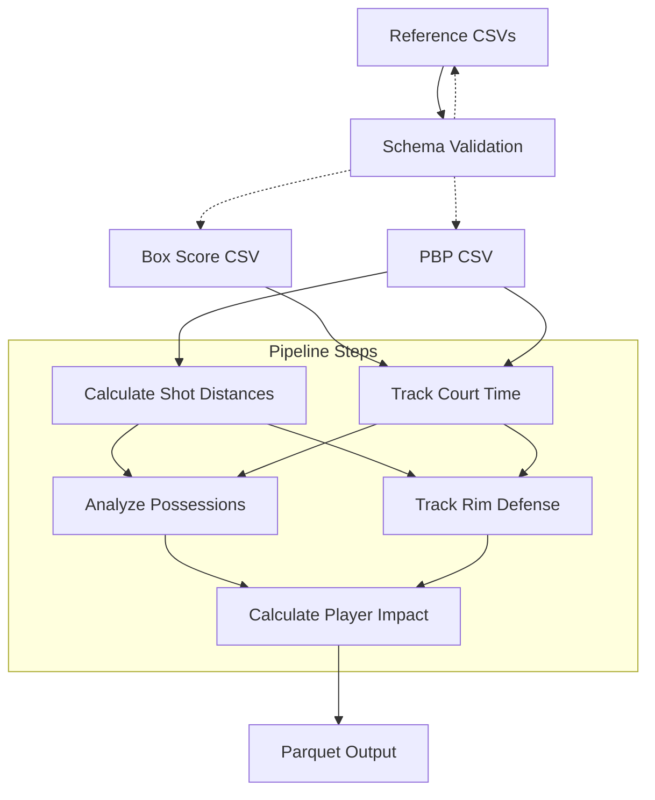
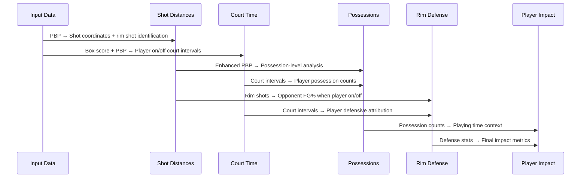

# Player Impact Pipeline

ETL pipeline for calculating individual player rim defense impact metrics from NBA play-by-play and box score data.

## Architecture



## Data Flow



## Core Transformations

### 1. Shot Distances (`shot_distance.py`)
**Input**: PBP with shot coordinates (`locX`, `locY`)  
**Output**: Enhanced PBP with `shot_distance` and `is_rim_shot` columns

**Logic**:
- Calculate Euclidean distance from basket (0,0) for all shot attempts
- Convert coordinates from tenths of feet to feet
- Mark shots ≤4 feet as rim shots
- Only process `msgType = 1` (made) and `msgType = 2` (missed) shots

### 2. Court Time (`court_time.py`)
**Input**: Box score (starters) + PBP (substitutions + activity)  
**Output**: Player court time intervals with period/wallClock boundaries

**Logic**:
- Extract starting lineups from `gs = 1` players in box score
- Track explicit substitutions from PBP `msgType = 8` events
- Infer re-entries from player activity when status shows "OUT" but player has activity
- Build chronological intervals for each player's court time

### 3. Possessions (`possessions.py`)
**Input**: Box score + PBP + Court time intervals  
**Output**: Offensive/defensive possession counts per player

**Logic**:
- Identify possession boundaries: made shots, defensive rebounds, turnovers, period ends
- Match possessions to players on court during possession timespan
- Count offensive possessions (player's team has ball) and defensive possessions (opponent has ball)
- Use middle of possession timespan for court time lookup

### 4. Rim Defense (`rim_defense.py`)
**Input**: Enhanced PBP (with rim shots) + Court time intervals  
**Output**: Rim defense statistics per player (on court vs off court)

**Logic**:
- Filter for rim shots only (`is_rim_shot = True`)
- For each rim shot, determine defending team players
- Track makes/attempts when player ON court vs OFF court
- Calculate rim FG% allowed in each situation
- Generate on/off difference (negative = better defender)

### 5. Player Impact (`impact.py`)
**Input**: Rim defense stats + Possession counts + Box score (player names)  
**Output**: Final impact table with comprehensive metrics

## Calculations

### Rim Defense Formulas
```
rim_fg_pct_on = rim_fgm_on / rim_fga_on
rim_fg_pct_off = rim_fgm_off / rim_fga_off
rim_fg_pct_diff = rim_fg_pct_on - rim_fg_pct_off
```

### Impact Interpretation
- **Negative difference**: Better defender (opponents shoot worse when player on court)
- **Positive difference**: Worse defender (opponents shoot better when player on court)
- **Large sample sizes**: More reliable impact estimates

### Aggregation Logic
- Group rim shots by defending player's on/off court status
- Sum makes and attempts for statistical power
- Calculate possession-based context for meaningful comparison
- Handle edge cases where players have limited on or off court data

## Data Assumptions

### Schema Requirements
- **Box Score**: `gs` identifies starters, `nbaId` for player IDs, `nbaTeamId` for team mapping
- **PBP**: `locX/locY` for shot coordinates, `msgType` for event classification, `wallClockInt` for timing

### Basketball Logic Assumptions
- **Rim Shot Definition**: 
  - Shots ≤4 feet from basket center (0,0 coordinates)
  - Based on Euclidean distance calculation
  - Only field goal attempts (`msgType = 1,2`)

- **Court Time Tracking**:
  - Hybrid approach: explicit substitutions + activity inference
  - Players can re-enter across period boundaries
  - 5 players per team on court at all times during active play

- **Defensive Attribution**:
  - All players on defending team credited/debited for opponent rim shots
  - Player's impact measured by team defensive performance when on vs off court
  - Rim shots attributed to player's on/off status at shot timing

- **Possession Context**:
  - Possession boundaries: made shots, rebounds, turnovers, period ends
  - Player possession counts provide context for minutes played and role
  - Offensive/defensive possessions tracked separately

### Edge Case Handling
- **Missing Coordinates**: Non-shot events marked with `shot_distance = -1`
- **Substitution Gaps**: Activity inference fills missing re-entries
- **Low Sample Sizes**: Mark players with insufficient rim shot exposure
- **Period Transitions**: Infer player status changes across periods

## Usage

```python
from players.etl import process_player_impact

file_paths = {
    "box_score": "data/box_HOU-DAL.csv",
    "pbp": "data/pbp_HOU-DAL.csv"
}

output_file = process_player_impact(
    file_paths=file_paths,
    output_path="output/player_rim_defense_impact.parquet"
)
```

## Output Schema

| Column | Type | Description |
|--------|------|-------------|
| `Player ID` | int | NBA player ID |
| `Player Name` | str | Player full name |
| `Team` | str | Team abbreviation |
| `Offensive possessions played` | int | Possessions when player's team had ball |
| `Defensive possessions played` | int | Possessions when opponent had ball |
| `Opponent rim FG% when player ON court` | float | Rim FG% allowed when player on court |
| `Opponent rim FG% when player OFF court` | float | Rim FG% allowed when player off court |
| `Opponent rim FG% on/off difference (on-off)` | float | Defensive impact (negative = better) |

## Validation & Quality Checks

### Pipeline Validation
- **Court Time Accuracy**: Compare calculated minutes vs box score minutes (target: <2min difference)
- **Possession Reasonableness**: Validate total possessions against expected game flow
- **Rim Shot Detection**: Verify rim shot percentage aligns with league averages (~35-40%)
- **Data Completeness**: Ensure sufficient sample sizes for meaningful impact calculations

### Key Metrics
- Players with complete data: >70% (minimum threshold)
- Average minutes difference: <3.0 minutes (court time validation)
- Rim FG% range: 0.400-0.800 (reasonable basketball values)
- Impact range: -0.100 to +0.100 (typical defensive impact spread)

## Known Limitations

### Sample Size Requirements
- Requires significant rim shot attempts for reliable impact measurement
- Single-game analysis may have high variance
- Players with limited minutes may show extreme but unreliable impacts

### Defensive Attribution
- Team-level attribution doesn't isolate individual player effect
- Help defense and rotations not captured in individual metrics
- Opponent shooting variance affects measurements

### Court Time Inference
- Activity-based inference may miss some substitutions
- Period transition gaps can affect accuracy
- Complex substitution patterns may be simplified